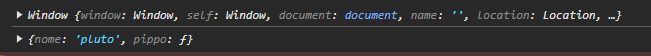

# nodeNpm

Prima roba inizializziamo npm
npm install live-server

Facciamo poi npm init, se non è una repo

Poi metto nel gitignore

$ npx live-server --port=3000 nel terminale

## HTML e CSS

Mettiamo il collegamento in fondo, per permettere al browser di completare la parte di html
E così inoltre lo script vede il DOM costruito

```html
<script src="js/app.js"></script>
```

Per metterlo in head, però caricarlo alla fine, basta aggiungere deferù

### DEFINIZIONE DEFER

This Boolean attribute is set to indicate to a browser that the script is meant to be executed after the document has been parsed, but before firing DOMContentLoaded.

Scripts with the defer attribute will prevent the DOMContentLoaded event from firing until the script has loaded and finished evaluating.

This attribute must not be used if the src attribute is absent, in this case it would have no effect.

To achieve a similar effect for dynamically inserted scripts use async="false" instead. Scripts with the defer attribute will execute in the order in which they appear in the document.


```html
<script src="js/app.js" defer></script>
```
## Custom properties

```css
:root {
    --main-color: #ff0000;
    --primario: #ff0000;
    --background: #f4f4f4;
}
```

si usano due -, seguite dal nome (da scrivere in cabek? case) e poi il valore

```css
h1 {
    color: var(--main-color);
}
```

## js

- document -> ci permette di accedere al DOM
    - queryselector -> selettore valdido
    - queryselectorAll -> tutti i selettori validi

si usano meno ora anche i seguenti
- getElementsByClassName 
- getElementsByTagName 
- getElementById

# trucchetti
- queryselector funziona anche su element

Per usare live server npx five-server (senza node )

this è un riferimento all'oggetto che sta chiamando la funzione

es. codice 
```js
function pippo() {
    console.log(this);
}
pippo();

const pluto = {
    nome: "pluto",
    pippo: function() {
        console.log(this);
    }
}

pluto.pippo();
```


altro esempio this

```js
const $ = document.querySelector();
const $$ = document.querySelectorAll();
```
Con questo esempio possiamo dedurre che $ e $$ sono funzioni che vengono chiamate su document e quindi this si riferisce a document 
In questi due casi non funziona $

Così però

```js
const $ = document.querySelector.bind(document);
const $$ = document.querySelectorAll.bind(document);
```
con bind si può legare this a document e quindi funziona

Usando queste due cose, si può semplificare la roba

se stampiano la lista (riga 71), vediamo che ci ritorna tutta la parte di html
    


(riga 77) se stampo il nuovo elemento che voglio creare, mi risulta (sulla console) li

opzioni per nuovo elemento
- textContent
- innerHTML
- innerText

(riga 83) aggiungo l'elemento 